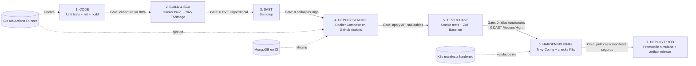

# FastTicket / PeruFest - Arquitectura DevSecOps propuesta

## Herramientas por función

- **Orquestación CI/CD:** GitHub Actions.
- **SCA/CVE:** Trivy sobre filesystem e imágenes Docker.
- **SAST:** Semgrep con reglas Node.js, JavaScript, secretos y Kubernetes.
- **DAST:** OWASP ZAP Baseline sobre el frontend desplegado en staging.
- **Hardening contenedores / IaC:** Dockerfiles no-root + Trivy config sobre manifests K8s.

## Decisión clave

El deploy a producción se **simula** dentro de GitHub Actions porque no hay AWS/Azure disponibles. El valor académico se conserva promoviendo el mismo bundle ya escaneado y aplicando una aprobación manual vía **GitHub Environment `production`**.
